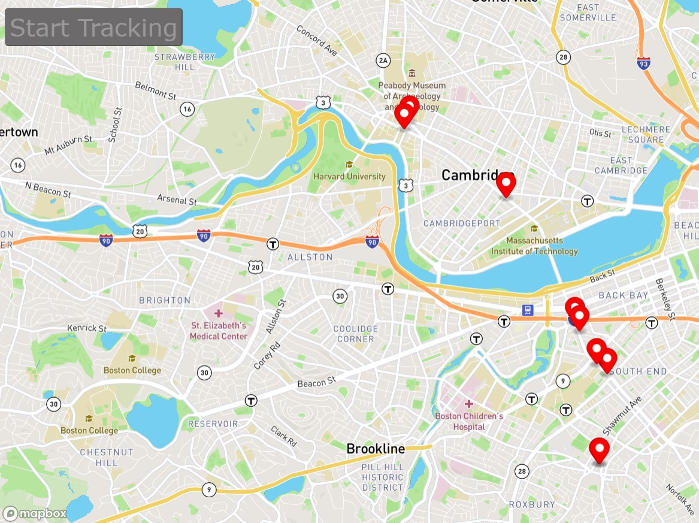

# Real-Time-Bus-Tracker

## Descripción del Proyecto:

El proyecto 'Real Time Bus Tracker' es una aplicación web que utiliza Mapbox y la API de MBTA para rastrear y mostrar en tiempo real la ubicación de autobuses que cubren una ruta por el MIT. Desarrollada con HTML, CSS y JavaScript, ofrece una visualización interactiva y precisa de la ubicación de los autobuses en un mapa.

## Como ejecutar

#### Requisitos Previos:

Un navegador web actualizado, recomendado Google Chrome.

#### Pasos para Ejecutar el Proyecto:

- Descarga todos los archivos del repositorio

- Abrir el archivo _index.html_ en tu navegador web:

  - Haz doble clic en el archivo HTML descargado.
  - O bien, abre tu navegador y arrastra el archivo HTML a la ventana del navegador.

- Interactúa con el proyecto.

- Para finalizar:

  Simplemente cierra la ventana o pestaña del navegador para detener la ejecución del proyecto.

## Roadmap para Mejoras Futuras:

1. Información Detallada de Autobuses:

   - Agregar información adicional sobre los autobuses, como el número de autobús, destino, etc., para una experiencia más informativa.

2. Personalización del Mapa:

   - Permitir a los usuarios cambiar el estilo del mapa (por ejemplo, satelital, terreno, etc.) según sus preferencias.

3. Seguimiento de Rutas Múltiples:

   - Implementar la capacidad de rastrear múltiples rutas de autobuses simultáneamente para una vista más amplia del transporte público.

4. Alertas y Notificaciones:

   - Incorporar alertas para informar a los usuarios sobre cambios en la ruta, retrasos o cualquier otra información relevante.

## Licencia

MIT License

Este proyecto está bajo la [Licencia MIT](https://opensource.org/licenses/MIT). Consulta el archivo LICENSE para más detalles
